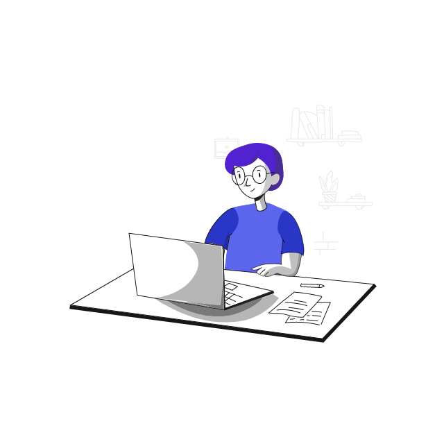

<h3 align="center">
  Hi there! I'm Lahiru Ransara. 
  </h3>

  

### I'm a UI/UX Engineer and a Technology Enthusiast!

- 🔭 I’m currently working as an Associate UI/UX Engineer in Random Software Ltd.
- 🌱 I’m currently learning Angular and React.
- 🥅 2023 Goals: Gaining more and more Industrial Experience.
- 📫 How to reach me: [lahiruransara](https://www.linkedin.com/in/lahiruransara/)
- 🎨 Portfolio: [Behance](https://www.behance.net/lahiruR) | [Dribbble](https://dribbble.com/lahiruR)
- ⚡ Fun fact: I love listening to music while working.

<!-- ### Languages :

   &emsp;
   &emsp;
   &emsp;
   &emsp;
   &emsp;

-->

### My Latest Articles:

<!-- BLOG-POST-LIST:START -->
- [Color Theory 101](https://www.linkedin.com/pulse/color-theory-101-lahiru-ransara/)

<!-- BLOG-POST-LIST:END -->

<!-- BLOG-POST-LIST:START -->
- [An Introduction to Human-Centered Design](https://www.linkedin.com/pulse/introduction-human-centered-design-lahiru-ransara/)

<!-- BLOG-POST-LIST:END -->

<!-- ### My Github Stats: -->

<!--  -->

<!--  -->
<!-- -->

<!--  -->
